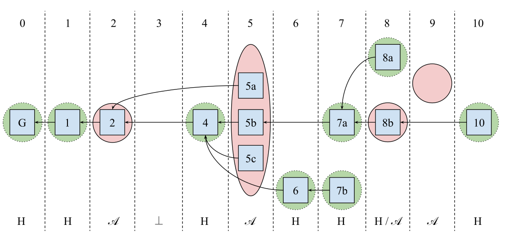

# -*- mode: org; -*-
#+title: Blockchain foundations flashcards

Course note: [[20260215225759]]

--------------------
* Probabilities

Q: Union bound
A: Έστω τα ενδεχόμενα \(X_1, X_2, \ldots, X_n\). Η πιθανότητα ένα από αυτά να τύχει φράζεται από το άθροισμα των αντίστοιχων πιθανοτήτων, δηλαδή:

\[\Pr\left[X_1 \vee X_2 \vee \ldots \vee X_n\right] \leq \Pr\left[X_1\right]+\Pr\left[X_2\right]+\cdots+\Pr\left[X_n\right].\]

Q: Γραμμικότητα μέσης τιμής για πιθανότητα επιτυχίας.
A: \[pn.\]

--------------------
* Signatures

Q: Existential forgery game (άτυπα)
A: Ο αντίπαλος \(\mathcal{A}\) δεν μπορεί να παράξει καινούργια έγκυρη υπογραφή, ακόμα και με signing oracle για άλλα μηνύματα.

--------------------
* Hash functions

C: 2nd pre-image resistance [⇒] pre-image resistance.

C: Pre-image resistance [⇐] 2nd pre-image resistance.

--------------------
* Transactions

--------------------
* Blocks

--------------------
* Chains

C: Υπό καθεστώς ορίου στο block size, ένας ορθολογικός miner συμπεριλαμβάνει πρώτα τις συναλλαγές με [την υψηλότερη αναλογία fees/byte].

--------------------
* Proof-of-Work

Q: Πιθανότητα επιτυχίας ενός query για δεδομένα \(\kappa, T\)
A: \[p=\frac{T}{2^{\kappa}}.\]

Q: Πιθανότητα των honest parties να βγάλουν ένα block, για δεδομένα \(n,t,p, q\) (PoW)
A: \[f = 1-(1-p)^{q(n-t)}.\]

Q: Ακριβής πιθανότητα επιτυχίας ενός query \(p\), για δεδομένα \(n,t,f, q\) (PoW)
A: \[p = 1-(1-f)^{\frac{1}{q(n-t)}}.\]

--------------------
* Merkle trees

Q: Length of proof size for one inclusion
A: log₂(tree-height) · hash bit length

--------------------
* Chain virtues / Backbone protocol

Q: Honest majority assumption
A: \[t< (1-\delta)(n-t).\]

Q: Balancing equation
A: \[3\epsilon + 3f \le \delta ~\Longrightarrow~ \epsilon=f = \frac{\delta}{6}.\]

Q: Minimum chain quality \(\mu\)
A: \[\mu \geq 1-\frac{\textrm { max. rate of adversarial blocks }}{\textrm { min. rate of chain growth }} \geq 1-\frac{t}{n-t}.\]

Q: Pairing lemma
A: Αν έχουμε convergence opportunity, το height του αντίστοιχου block είναι μοναδικό.

--------------------
* Light clients

Q: Τι κατεβάζει ένα SPV light wallet και γιατί;
A: 1. Header κάθε block για επιβεβαίωση της αλυσίδας και του proof-of-work

2. Merkle proofs για transactions που αφορούν το wallet address

--------------------
* Proof-of-Stake

C: Σε PoS longest-chain puzzle, ένας adversary μπορεί να προτείνει [άπειρα] έγκυρα blocks.

C: Ένα PoS longest chain πρωτόκολλο είναι *safe* και *live* για \(t<\)[\(\frac{n}{2}\)].

Q: Πιθανότητα των honest parties να βγάλουν ένα block, για δεδομένα \(n,t,p\) (PoS)
A: \[f = 1-(1-p)^{n-t}.\]

Q: Ακριβής πιθανότητα επιτυχίας ενός query \(p\), για δεδομένα \(n,t,f\) (PoW)
A: \[p = 1-(1-f)^{\frac{1}{n-t}}.\]

Q: PKI assumption
A: Κάθε party έχει σταθερό public key το οποίο το γνωρίζουν όλοι.

Q: PoS ticket inequality
A: \[H(\rho^i \| pk \| r) < T\cdot\phi(\omega),\]

    όπου \(r\) το slot, \(\rho^i\) το randomness του epoch \(i\), \(H\) μια VRF, \(\omega\) το stake μου και \(\phi: \omega \to [0,1]\) μία συνάρτηση που μετατρέπει το stake σε ποσοστό.

    Π.χ. \(\phi(\omega)= \omega\).

Q: Grinding attack
A: Χρήση computational queries σε PoS πρωτόκολλα.

    Ο adversary πειραματίζεται με το hash input για να κερδίσει το lottery.

    Στο PoW το grinding είναι μέρος του πρωτοκόλλου.

Q: Τι αποτρέπει και τι επιτρέπει το PoS όσον αφορά grinding attacks;
A: Αποτρέπει επιθέσεις στα tickets αλλά επιτρέπει επιθέσεις στα blocks ενός συγκεκριμένου slot.

    

Q: Equivocation
A: Παραγωγή πολλαπλών blocks για το ίδιο slot.

C: Τα fan outs σε PoS longest chain πρωτόκολλα είναι [πάντα adversarial].

Q: PoS block signing
A: \[ \mathrm{Sign}(sk, j \| \rho^j \| r \| x\| s \| pk \| \pi \| y).\]

Q: PoS block header
A: \[ j \| \rho^j \| r \| x\| s \| pk \| \pi \| y \| \sigma,\]

    με \(\sigma \leftarrow \mathrm{Sign}(sk, j \| \rho^j \| r \| x\| s \| pk \| \pi \| y)\).

Q: Τι ελέγχουμε στο PoS block validation για τα slots;
A: Ότι είναι *αύξοντα* και *στο παρελθόν*.

Q: Bounded state shifting assumption
A: Τα χρήματα δεν μετακινούνται πολύ γρήγορα ανάμεσα σε epochs.

Q: Πώς βρίσκω το καινούργιο stake distribution όταν μπαίνω σε νέο epoch;
A: Όταν φτάσω σε slot \(r \equiv 0 \bmod m\), κόβω τα τελευταία \(v\) slots και παίρνω το state του block του προηγούμενου slot ως το stake distribution.

Q: Τύπος \(v\) για εύρεση νέου stake distribution ανάμεσα σε epochs
A: \[v = \max \left( \frac{k+l+1}{\tau},  s+1 \right).\]

Q: Super safety
A: Όλοι συμφωνούν απολύτως με όλους τους άλλους.

    Κυρίως αφορά το safety σε PoS όσον αφορά το stake update ανάμεσα σε epochs.

Q: Τι σχέση έχουν τα coins και τα public keys;
A: Κάθε public key μπορεί να έχει ένα ή κανένα coin.

Q: Παραγωγή epoch randomness \(\rho^j\)
A: \[\rho^j = \bigoplus_{i=1} \rho_i^j \in \{0,1\}^{\kappa},\quad \rho_i^j = G(\rho^{j-1}\| r \| pk),\]

    όπου \(i\) το index του block στο epoch, \(j\) το επόμενο epoch και \(G\) ένα VRF.

Q: Verifiable Random Function (VRF) scheme
A:
    1. \(\mathrm{VRF.Gen}(1^{\kappa}) \rightarrow (sk, pk),\)

    2. \(\mathrm{VRF.Eval}(sk, x) \rightarrow y, \pi,\)

    3. \(\mathrm{VRF.Ver}(pk, x, y, \pi) \rightarrow 0 \lor 1\)

Q: Static adversary
A:
    1. Adversary corrupts chosen parties

    2. Randomness at epoch 0 is generated

Q: Adaptive adversary
A: Corrupts parties dynamically

Q: Πώς αποτρέπονται τα long-range attacks;
A: Μέσω key erasure

C: Τα long-range attacks αφορούν [slowly] adaptive adversaries.

C: Οι fully adaptive adversaries αντιμετωπίζονται χρησιμοποιώντας [VRF για το ticket hash].

Q: Aggregation independent function
A: \[\phi(\omega)= 1-(1-\phi(\omega))^n\]

