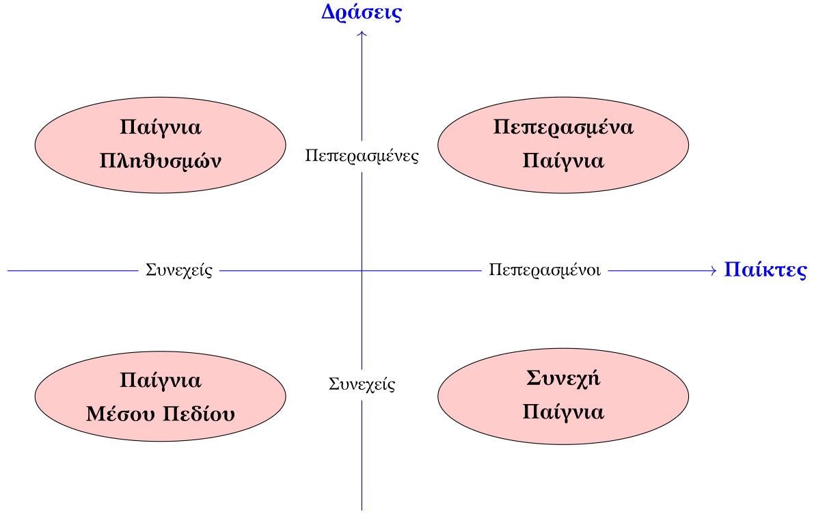

* Θεωρία Παιγνίων, ΑΛΜΑ

 Παναγιώτης Μερτικόπουλος, «Θεωρία Παιγνίων». Χειμώνας 2026-2027. https://eclass.uoa.gr/courses/MATH806/.

** 2026-09-28 - 1ο μάθημα

T: Παίγνιο σε κανονική/στρατηγική μορφή
D: Μια πλειάδα \(\mathcal{G}\equiv \mathcal{G}(\mathcal{N},\mathcal{A}, u)\) με

    1. \(\mathcal{N}\) το σύνολο των \(N\) /παικτών/ (πεπερασμένο ή συνεχές)
    2. \(\mathcal{A}_i\) το σύνολο /δράσεων/ /καθαρών στρατηγικών του παίκτη \(i\) (πεπερασμένο ή συνεχές)
       - \(\mathcal{A}=\mathcal{A}_1\times \ldots \times \mathcal{A}_N\) το σύνολο όλων των /προφίλ/ δράσεων 
    3. \(u_i: \mathcal{A} \to \mathbb{R}\) η /συνάρτηση πληρωμής/ (ή ωφέλειας) του παίκτη \(i\)

Q: Διαφορά παιγνίων σε κανονική και σε εκτεταμένη μορφή
A: Στην κανονική μορφή, οι παίκτες επιλέγουν δράσεις «ταυτόχρονα», ενώ στην εκτεταμένη μορφή οι παίκτες επιλέγουν δράσεις με σειρά/βήματα.

Q: Ταξινόμηση παιγνίων βάσει συνέχειας δράσεων και παικτών
A:

    

# Local Variables:
# eval: (progn (require 'ox-gfm) (add-hook 'after-save-hook #'org-gfm-export-to-markdown nil t))
# End:
